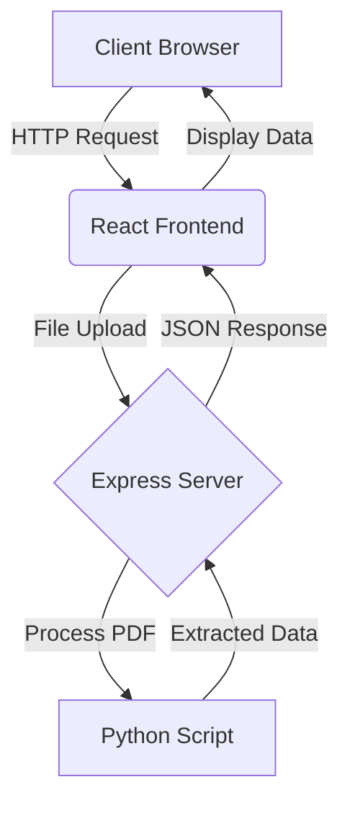

# PDF Extractor

## Project Overview

PDF Extractor is a web application that allows users to upload PDF files and automatically extract specific details such as Name, Phone Number, Address, and Role. The extracted information is then displayed in a user-friendly format on the frontend. Live Demo link is attached at the end. Read the instructions carefully.

## Features

- PDF file upload
- Automatic extraction of Name, Phone Number, Address, and Role
- Display of extracted information
- Error handling for invalid files or processing issues

## Architecture

The application follows a client-server architecture with three main components:

1. Frontend (React)
2. Backend (Node.js with Express)
3. PDF Processing (Python script)

### Architecture Diagram

## Request Flow

| Step | Request Type | From | To | Description |
|------|--------------|------|----|--------------------|
| 1 | GET | Client | React Frontend | Load the web application |
| 2 | POST | React Frontend | Express Server | Upload PDF file |
| 3 | - | Express Server | Python Script | Process PDF and extract data |
| 4 | - | Python Script | Express Server | Return extracted data |
| 5 | JSON Response | Express Server | React Frontend | Send extracted data |
| 6 | - | React Frontend | Client | Display extracted data |

## Setup and Installation

1. Clone the repository
2. Install dependencies:
   - For frontend: `cd frontend && npm install`
   - For backend: `cd backend && npm install`
   - For Python script: `pip install pdfplumber spacy`
3. Start the servers:
   - Frontend: `npm start` in the frontend directory
   - Backend: `node server.js` in the backend directory
4. Access the application at `http://localhost:3000`
5.Check server.js file in backend and change the port number for cors use if application is not running on 3000.

## Usage

1. Open the application in your web browser
2. Click on the file upload area or drag and drop a PDF file
3. Click the "Upload" button
4. Wait for the file to be processed
5. View the extracted information displayed on the screen

## Technologies Used

- Frontend: React, Axios
- Backend: Node.js, Express, Multer
- PDF Processing: Python, pdfplumber

## Live Demo Link
- https://loom.com/share/9f89e53fca454230a0ea5a9338799b1e
